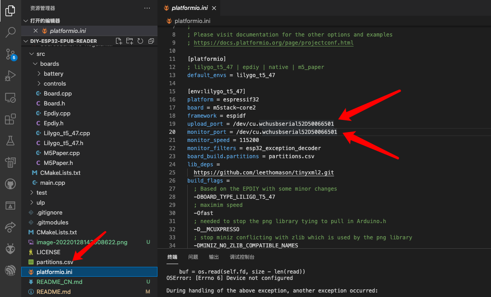
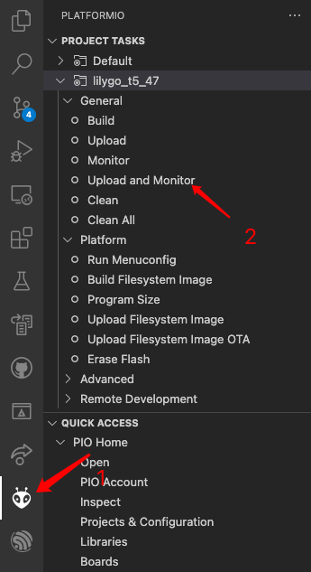

## **[English](./README.MD) | 中文**

# 英文的为原版说明

# 开始前准备材料

+ Lilygo 4.7寸开发板
+ 锂电池
+ Lilygo SD卡扩展板（如果使用SPI FFS也可以不使用SD卡就是放不下多少书）
+ SD卡
+ type C 数据线

# 软件环境

+ VS Code
+ PalformIO 插件（编译烧录用）
+ python3 （如果需要添加字库需要用到）
+ git

# 操作步骤

1. 下载本仓库 git clone --recursive https://github.com/trumeen/diy-esp32-epub-reader.git

2. 使用VS 打开下载后的根目录，前提是已经安装好了PlaformIO 插件，如果对VS安装插件不熟悉可以在网络上查找相关资源

3. 通过USB线连接开发板与电脑，记得安装对应串口的驱动

4. 修改plaformio.ini 文件中的上传和日志串口,如图将对应的串口修改为设备的串口号（Windows 平台为ComX）

   

5. 按照图片说明依次点击PlafromIO 图标与lily go_t5_47 下的Upload and Monitor 

   

6. 等待上传完成，上传完成后，拔掉USB线，点击最上方的按钮，重启设备。（目前已知问题，在接USB的时候重启会无限重启，使用电池供电无该问题，暂时先忽略这个问题）

7. 本项目默认使用的SDCard，请将epub图书放入SD根目录下，文件名字不要使用中文，使用中文读取存在问题。

3. 如果没接SD卡也可以使用SPIFFS，如果要使用SPIFFS需要修改分区表，增加SPIFFS分区，该步骤可以参考英文项目进行操作，不推荐使用该方式。使用该方式更新图书每次需要更新代码。相对麻烦，而且储存空间大小也有限制。

#  已知问题

+ 使用USB供电会无限重启（使用电池供电无该问题）

+ 由于单个文件限制，无法将整个中文字库导入，目前项目导入的是常用的7千个汉字，基本能够应付一般的图书。在使用中有个人很影响阅读的可以自行添加。如果有大佬也可以提交将字库放入SD卡的实现方案。

+ 由于ESP32 RAM大小的限制，目前EPUB图书中当个章节大小超过280K会导致内存溢出，如果真的遇到了可以自行修改EPUB图书，将大的章节拆分一下。

  

# 其它

+ 关于触摸屏，个人建议不需要购买，直接使用按键挺香，而且触摸与SD卡由于复用IO两者无法兼得

+  某宝上的外壳相对来说还是比较简陋，有能力的大佬可以直接画一个外壳
+ 整体的厚度还是比较厚的，大佬可以根据提供的原理图自己画PCB，可以更好的控制厚度。某鱼上也有对应的屏幕卖。
+ 先有个初步的可以用的，后续看时间继续优化吧。

  

  

